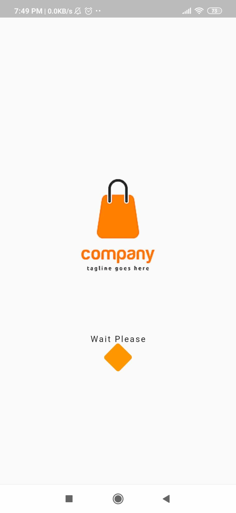
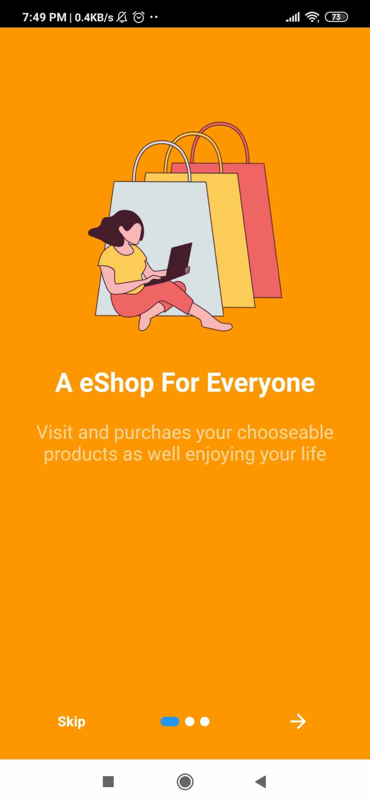
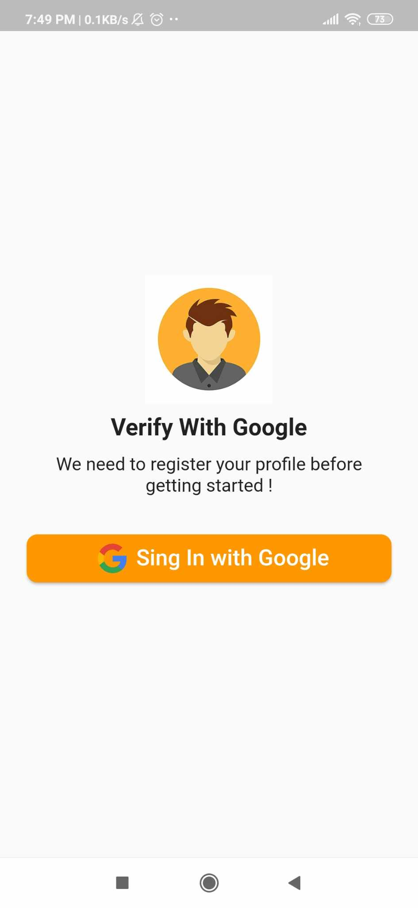
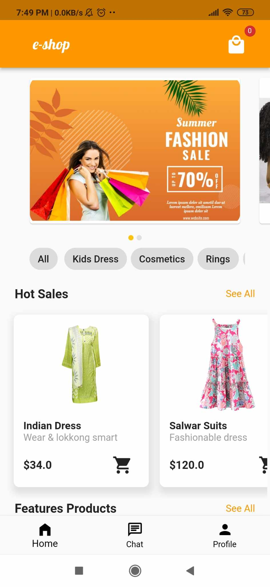
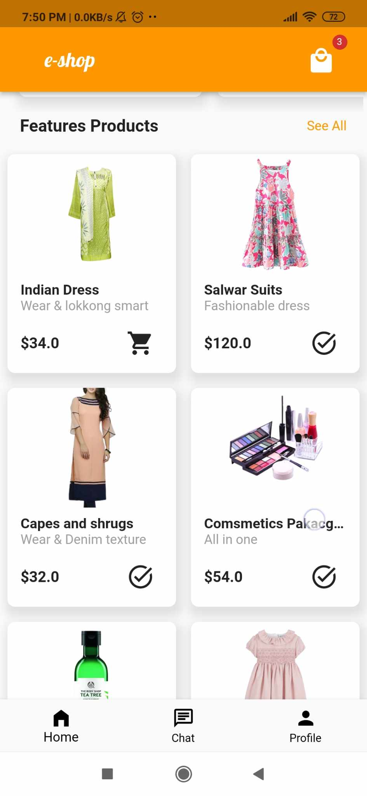
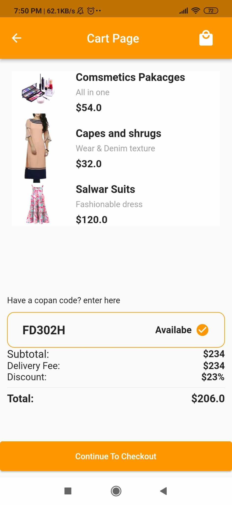
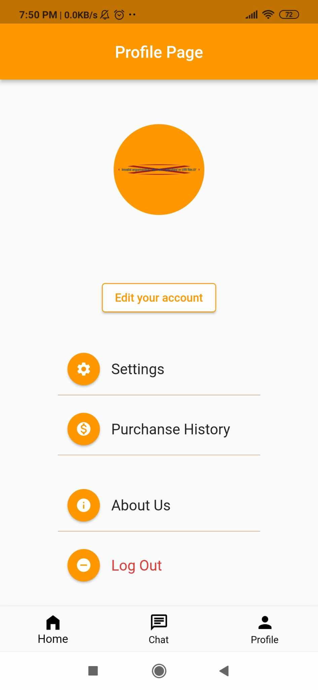
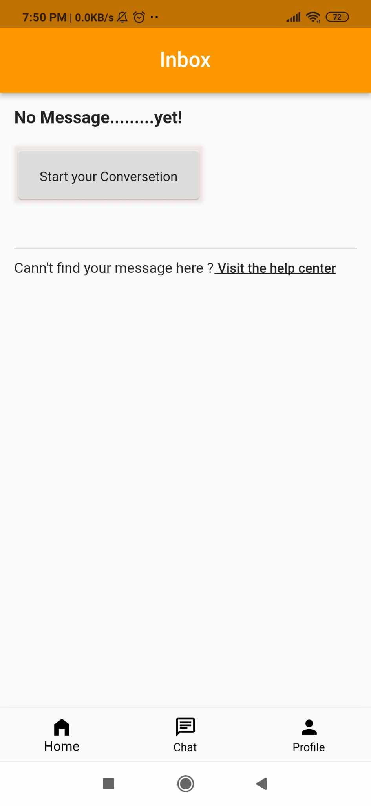

# eshop
Here this is an ecommarce application,using this app user can buy his product____

## Features
This project contains the several features like
* Signin with Google
* Friendly Homescreen
* User Profile
* Cart Section
* Chatting Option
As a back-end database it uses **Firebase**
## App Screens-

    
    
    

    
    
    

    
    
   

